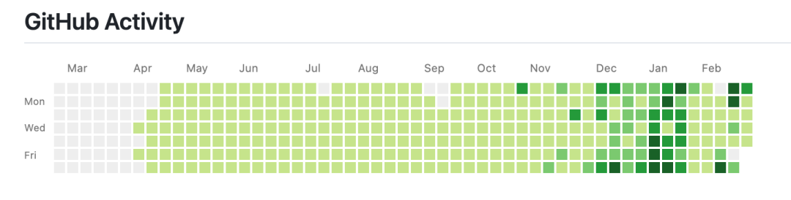
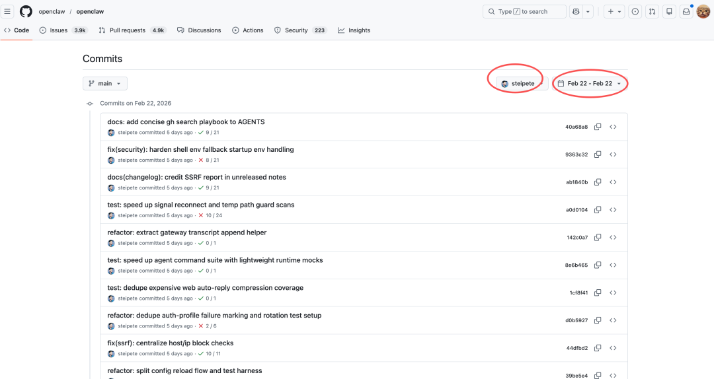

# 啊啊啊？1天提交了627次代码？

来源：https://mp.weixin.qq.com/s/B5hK8BywPla6LG3hVxHGqA
抓取：https://mp.084817.xyz/s/B5hK8BywPla6LG3hVxHGqA

---
 

# 啊啊啊？1天提交了627次代码？

原创 刘小排 刘小排 [ 刘小排r ](javascript:void%280%29;) 

在小说阅读器中沉浸阅读

哈喽，大家好，我是刘小排。

昨天我在琢磨这篇文章 [我做Claude Code榜一大哥的时候，OpenClaw的作者Peter是榜三……当时他在干啥？](https://mp.weixin.qq.com/s?%5F%5Fbiz=MzI1MTUxNzgxMA==&mid=2247501197&idx=1&sn=079abd6b5d20721b603f11d2c47f72db&scene=21#wechat%5Fredirect) 的时候，发现了OpenClaw作者Peter Steinberger过去半年的代码提交记录。

你看出来了没？ 在2025年11月以前，他写代码并不多，每天都是浅绿色，很均匀。但是从11月开始（也就是从做OpenClaw项目开始），偶尔有很深很深的绿色，每天提交了**很多次**代码。“很多次”，到底有多少次呢？



说出来吓死你，Peter曾经一天之内，给OpenClaw提交了627次代码！

我让小龙虾统计了Peter Steinberger (steipete) 单人单日提交次数 Top 5：

| 时间        | Peter单人提交代码次数 |
| --------- | ------------- |
| 2月22日（周日） | 627次          |
| 2月16日（周一） | 490次          |
| 2月15日（周日） | 461次          |
| 2月14日（周六） | 447次          |
| 2月21日（周六） | 315次          |

天呐！！一天只有1440分钟啊！！不吃不喝不睡不上厕所，也要平均每2分钟提交一次。

建议你自己点击进去看看，感受一下：

https://github.com/openclaw/openclaw/commits/main/?since=2026-02-22&until=2026-02-22&author=steipete



我第一反应是：这脑容量得多大啊？尤其是当我看到Peter的这张工作截图后，差点崩溃……


我曾经并行开8个窗口，已经吃不消了。Peter大哥，这同时开了30个啊……

肯定是因为他天赋异禀，脑容量大！！

但是，我一条条翻下去，翻着翻着意识到：

不对！和同时开窗口多没关系！和脑容量也没关系！

因为，从提交记录看，这些代码绝对不是人手敲的！！

平均2分钟提交一次代码，就算是写需求，都写不过来这么多！！

你能一天之内写627个需求并且让AI写完代码再完成验收吗？

我去翻了他提交量最猛的2月22日——也就是提交了627次那天。

晚上21:18这一段，最能说明问题：

```

21:18:02  refactor(agents): dedupe workspace and session tool flows
21:18:10  refactor(commands): centralize shared command formatting helpers
21:18:19  refactor(config): dedupe install and typing schema definitions
21:18:30  refactor(daemon): share runtime and service probe helpers
21:18:53  refactor(channels): dedupe hook and monitor execution paths
21:19:07  refactor(security): split elevated allowFrom matcher internals


```

数数。6次提交，65秒。平均每11秒一次。

11秒你连代码文件都来不及打开，更别说重构了。

再看凌晨这一段，更离谱：

```

00:16:52  test(cli): use lightweight clear for cron gateway mock
00:20:09  test(discord): use lightweight clear for thread binding rest mock
00:23:08  test(cli): use lightweight clears in message helper and gateway chat setup
00:24:59  test(discord): use lightweight clears in outbound plugin setup
00:28:34  test(cli): use lightweight clears in daemon lifecycle setup
00:30:04  test(agents): use lightweight clears for stable subagent announce defaults


```

凌晨零点到零点半，14次提交，全是"use lightweight clears"——AI在批量优化测试代码的初始化方式。

Peter住在维也纳。凌晨零点。他在睡觉，AI在干活。

## Peter是怎么做到的

看懂下午这段提交，我就全明白了：

```

16:05:20  fix(infra): treat undici fetch failed as transient unhandled rejection
16:06:59  fix(telegram): restart stalled polling after unhandled network errors
16:08:29  fix(net): enable family fallback for pinned SSRF dispatcher
16:09:06  docs(telegram): align Node22 network defaults and setup guidance
16:11:24  feat(update): add core auto-updater and dry-run preview
16:20:20  refactor(security): unify local-host and tailnet CIDR checks
16:40:42  fix(update): run auto-update via runtime argv and keep it independent of checkOnStart
16:45:23  fix(telegram): keep webhook monitor alive until abort
16:47:12  fix(telegram): harden polling retry setup and teardown order
16:48:08  fix(telegram): clear webhook state before polling startup
16:49:59  fix(telegram): wire webhookPort through config and startup
16:52:04  fix(telegram): notify users on media download failures
16:58:51  fix(logging): cap file logs with configurable maxFileBytes


```

我悟了！！

  
**正常人类的AI编程流程**：人类发现问题 → 人类写需求文档发给AI、复制报错信息给AI → AI写代码 → 人类验证。

**Peter的流程**： AI自动发现问题 → AI自动修复 → AI自动写文档 → AI自动写代码 → AI自动测试 → AI自动重构代码 → AI再次自动测试 → AI再次自动测试 → AI再次自动fix ……

  
这就是627次提交的真相：

不是一个人在疯狂敲代码！

是一条AI驱动的流水线在自动运转——发现问题、写文档、写代码、跑测试、发现问题、修复、再跑测试、通过了自动提交。每个循环大概一两分钟。

人类只做一件事：定目标、定边界。剩下的，AI自己闭环。

我跪了！服了！！

## 我学习到的

**第一，自动化测试不是可选项，是前提。**

627次提交之所以不等于627次翻车，是因为每一次提交都在自动跑测试，不过就不合并。

在昨天的文章[我做Claude Code榜一大哥的时候，OpenClaw的作者Peter是榜三……当时他在干啥？](https://mp.weixin.qq.com/s?%5F%5Fbiz=MzI1MTUxNzgxMA==&mid=2247501197&idx=1&sn=079abd6b5d20721b603f11d2c47f72db&scene=21#wechat%5Fredirect) 里我也提交到，从Peter过去大半年的工作习惯来看，他总是喜欢让AI自动工作、自动完成闭环、最大化的降低人类参与。

**第二，让AI自己完成闭环，而不是你盯着它。**

Peter不是在那儿一条条审查AI的代码。他设好了规则——CI必须通过、安全检查必须通过、测试必须通过——然后让AI自己跑。

AI写完代码自己测，测不过自己改，改完再测，直到通过才提交。

人类只在规则层面介入，不在执行层面介入。

**第三，粒度越细越安全。**

你一次PR改1000行，出了bug，只能一口气回滚今天全天的工作。 （嗯，这是我公司曾经真实发生过的事，新员工刚刚开始学习AI编程的时候。）

Peter一次提交改几行，哪次出了问题，一秒定位，一秒回滚。

---

我跟公司同事分享Peter的故事。

同事问我：那我们以后还需要学写代码吗？

我说：你学不学开车，车都在那儿。区别是你开车、还是车开你、还是你定好方向，让车自己开。

  
预览时标签不可点

修改于 

微信扫一扫  
关注该公众号

继续滑动看下一个 

轻触阅读原文 

 

 刘小排r 

向上滑动看下一个 

[知道了](javascript:;) 

 微信扫一扫  
使用小程序 

[取消](javascript:void%280%29;) [允许](javascript:void%280%29;) 

[取消](javascript:void%280%29;) [允许](javascript:void%280%29;) 

[取消](javascript:void%280%29;) [允许](javascript:void%280%29;) 

× 分析 

 

微信扫一扫可打开此内容，  
使用完整服务

： ， ， ， ， ， ， ， ， ， ， ， ， 。 视频 小程序 赞 ，轻点两下取消赞 在看 ，轻点两下取消在看 分享 留言 收藏 听过 

---

PDF（Google Drive）:
https://drive.google.com/file/d/15-jUPssaXrRE73wMXhNemcNYbIrsrsg0/view?usp=drivesdk

